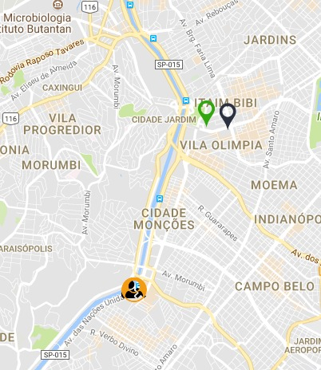

  

# CicloSp, Web page to help cyclist find nearby cycle track

## Browser Support

This Application relies on [Fetch API](https://fetch.spec.whatwg.org/). And this API is supported in the following browsers.

 |  |  |  |  |
--- | --- | --- | --- | --- |
39+ ✔ | 42+ ✔ | 29+ ✔ | 10.1+ ✔ | Nope ✘ |

## How to Run

1. Install the dependencies with `npm i`.
2. Run your application with `npm start`.

## Something in the future?
- [ ] Show all input/output of bicycle path 'Rio Pinheiros/Tietê' in GoogleMaps

## Contributing

Please read [CONTRIBUTING.md](CONTRIBUTING.md) for details on our code of conduct, and the process for submitting pull requests to us.

## Versioning

We use [SemVer](http://semver.org/) for versioning. For the versions available, see the [tags on this repository](https://github.com/gabrieldarezzo/ciclosp/tags).

## Authors

| |
|:---------------------:|
|  [Gabriel Darezzo](https://github.com/gabrieldarezzo/)   |

## License

This project is licensed under the MIT License - see the [LICENSE.md](LICENSE.md) file for details

